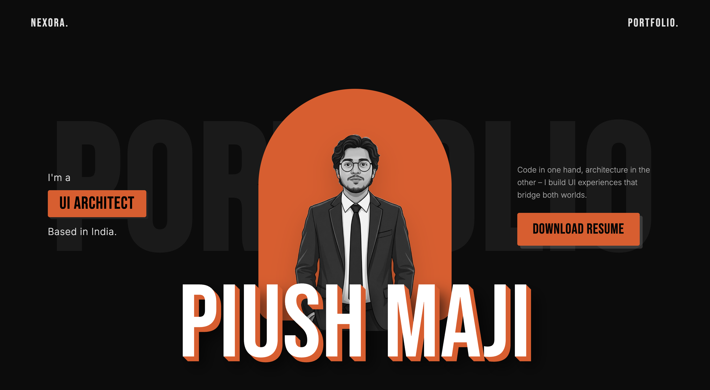
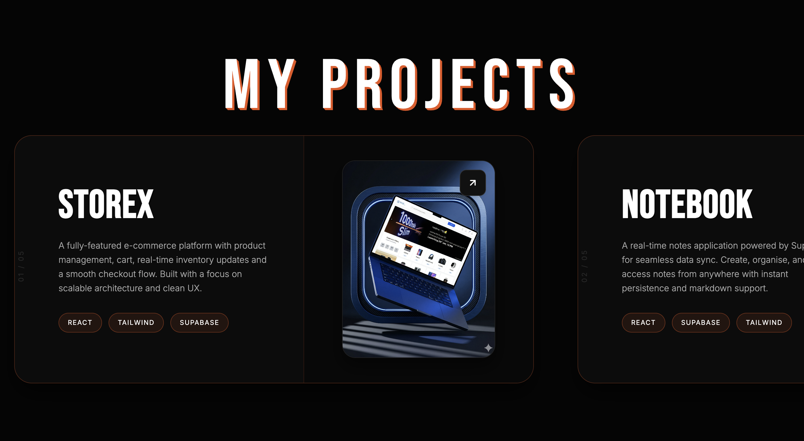
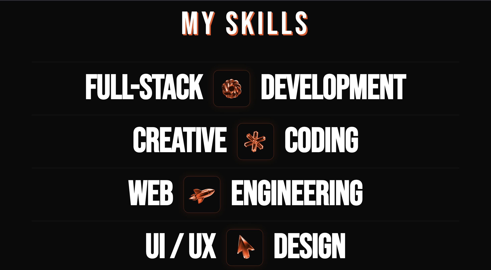
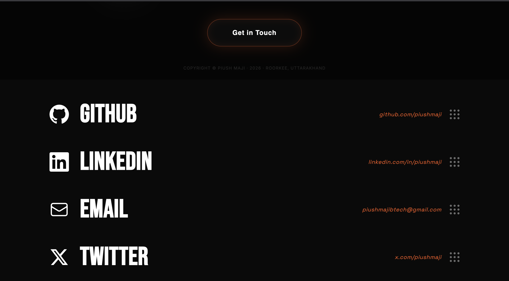
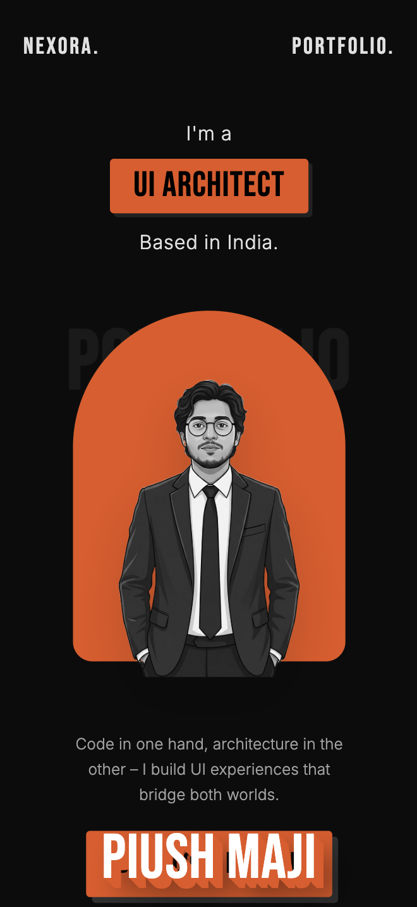

<div align="center">

<br/>

```
███╗   ██╗███████╗██╗  ██╗ ██████╗ ██████╗  █████╗
████╗  ██║██╔════╝╚██╗██╔╝██╔═══██╗██╔══██╗██╔══██╗
██╔██╗ ██║█████╗   ╚███╔╝ ██║   ██║██████╔╝███████║
██║╚██╗██║██╔══╝   ██╔██╗ ██║   ██║██╔══██╗██╔══██║
██║ ╚████║███████╗██╔╝ ██╗╚██████╔╝██║  ██║██║  ██║
╚═╝  ╚═══╝╚══════╝╚═╝  ╚═╝ ╚═════╝ ╚═╝  ╚═╝╚═╝  ╚═╝
```

### `// PORTFOLIO ARCHITECTURE — BY PIUSH MAJI`

<br/>

[](https://nexorabypiush.vercel.app/)
[](https://react.dev/)
[](https://vitejs.dev/)
[](https://gsap.com/)
[](https://tailwindcss.com/)

<br/>

> *"Built to be seen. Engineered to be felt."*

<br/>

</div>

---

<br/>

## ◈ VISUAL SHOWCASE

<br/>

### 01 — Hero / Archway Landing

<div align="center">
  
</div>

> **The Symmetrical Archway** — A 4-layer Z-index composition. A dark industrial `PORTFOLIO` watermark anchors the canvas, layered beneath an ultra-thick 10-layer CSS 3D-extruded foreground name `PIUSH MAJI`. No UI kit, no shortcuts — entirely hand-engineered.

<br/>

---

### 02 — Projects / Cinematic Horizontal Scroll

<div align="center">
  
</div>

> **The Horizontal Pin** — GSAP `ScrollTrigger` hijacks the vertical viewport (`pin: true`). Vertical mouse velocity is translated into horizontal movement with 0-lag scrubbing (`scrub: 1`). Each project card slides in with staggered depth offsets.

<br/>

---

### 03 — About / Biographical Architecture

<div align="center">
  
</div>

> **The Identity Layer** — Type-first layout featuring oversized editorial numerals, tracked-out sub-labels, and asymmetric column breaks. Every detail reinforces the Obsidian brand system: `#050505` canvas, `#E8541A` accent.

<br/>

---

### 04 — Contact / Magnetic Parallax

<div align="center">
  
</div>

> **Magnetic Interactions** — Floating 3D `.avif` shapes respond to viewport cursor tracking via absolute positioning. The CTA button uses a custom liquid-fill "button-pull" effect that snaps back on release — zero library dependency.

<br/>

---

### 05 — Mobile Responsiveness

<div align="center">
  
</div>

> **Breakpoint Integrity** — The archway hero, horizontal scroll pin, and magnetic effects all gracefully degrade to full-viewport mobile experiences without losing the cinematic language.

<br/>

---

<br/>

## ◈ ABOUT THE PROJECT

```
STATUS ········· Production-Ready
CANVAS ·········  #050505  True Black
ACCENT ·········  #E8541A  Neon Orange
FONT (DISPLAY) · Bebas Neue
FONT (BODY) ···· Inter
TARGET FPS ····· 60fps sustained
```

Nexora is a **cinematic developer portfolio** that refuses the default. Where most developer portfolios end at a flat card grid and a hero section, Nexora constructs a full spatial environment — layered depth, physics-informed scrolling, and magnetic interaction design that signals senior craft to design agencies, engineering leads, and creative recruiters on first scroll.

The **Obsidian Brand System** (`#050505` + `#E8541A`) is not a color choice — it's a statement. Every animation, typeface decision, and spacing ratio serves a singular editorial voice.

<br/>

---

<br/>

## ◈ TECHNICAL ARCHITECTURE

<br/>

```
┌─────────────────────────────────────────────────────────────┐
│                     NEXORA STACK                            │
├──────────────┬──────────────────────────────────────────────┤
│  Framework   │  React 19 + Vite (HMR, tree-shaking)         │
│  Styling     │  TailwindCSS 3 (utility-first, purged)        │
│  Animation   │  GSAP 3 + ScrollTrigger Plugin                │
│  Typography  │  Bebas Neue (display) · Inter (body)          │
│  Assets      │  .avif (parallax) · .png (layered elements)   │
│  Deploy      │  Vercel (zero-config, edge CDN)               │
└──────────────┴──────────────────────────────────────────────┘
```

<br/>

### Animation Systems Breakdown

| System | Technique | Performance |
|--------|-----------|-------------|
| **Archway Hero** | 4-layer Z-index + CSS 3D text-shadow stacking | GPU-composited, `will-change: transform` |
| **Horizontal Pin** | GSAP ScrollTrigger `pin: true`, `scrub: 1` | rAF-synced, 0-lag |
| **Parallax Shapes** | Cursor-tracked absolute positioning | Debounced `mousemove` |
| **Magnetic Button** | Custom spring physics on `mousemove` delta | Vanilla JS, no deps |
| **Entrance Reveals** | GSAP `fromTo` stagger chains | Intersection Observer trigger |

<br/>

---

<br/>

## ◈ QUICK START

```bash
# 1 — Clone the repository
git clone https://github.com/piushmaji/Nexora.git

# 2 — Move into project root
cd nexora

# 3 — Install all dependencies (React 19, Tailwind, GSAP)
npm install

# 4 — Launch Vite dev server with HMR
npm run dev

# 5 — Production build (case-sensitive path resolution included)
npm run build
```

<br/>

> **Note on Vercel Deploys:** All asset paths in `Projects.jsx` are matched to exact filesystem casing for Linux build compatibility. Do not rename image files after cloning.

<br/>

---

<br/>

## ◈ PROJECT STRUCTURE

```
nexora/
├── public/
│   ├── screenshots/         ← README preview images
│   └── shapes/              ← .avif parallax assets
├── src/
│   ├── components/
│   │   ├── Hero.jsx          ← Archway layout + 3D type
│   │   ├── Projects.jsx      ← GSAP horizontal pin scroll
│   │   ├── About.jsx         ← Editorial biography section
│   │   └── Contact.jsx       ← Magnetic button + parallax
│   ├── styles/
│   │   └── index.css         ← Tailwind directives + CSS vars
│   ├── App.jsx
│   └── main.jsx
├── tailwind.config.js
├── vite.config.js
└── package.json
```

<br/>

---

<br/>

## ◈ BRAND SYSTEM

```
┌──────────────────────────────────────────┐
│  OBSIDIAN BRAND SCALE                    │
│                                          │
│  ████  True Canvas    #050505            │
│  ████  Neon Accent    #E8541A            │
│  ████  Off-White      #F0EDEA            │
│  ████  Muted Text     #888580            │
│                                          │
│  DISPLAY  →  Bebas Neue  (400)           │
│  BODY     →  Inter       (400 / 500)     │
└──────────────────────────────────────────┘
```

<br/>

---

<br/>

<div align="center">

```
DESIGNED & ENGINEERED BY PIUSH MAJI
```

[](https://github.com/piushmaji)
[](https://nexorabypiush.vercel.app/)

<br/>

*Built with obsessive attention to craft. No UI templates. No shortcuts.*

<br/>

</div>